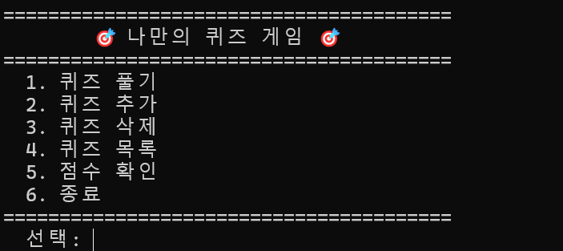
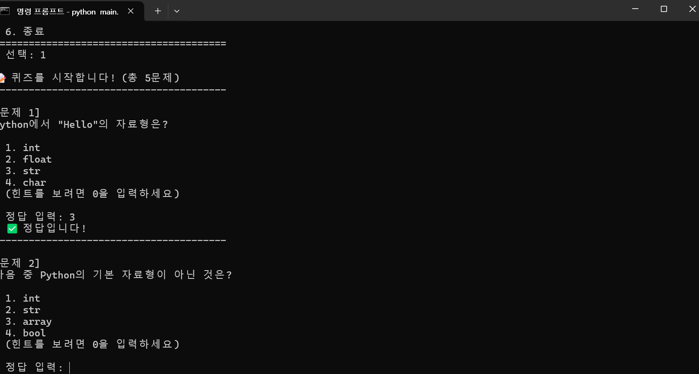
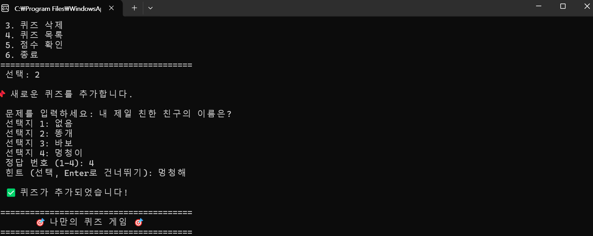
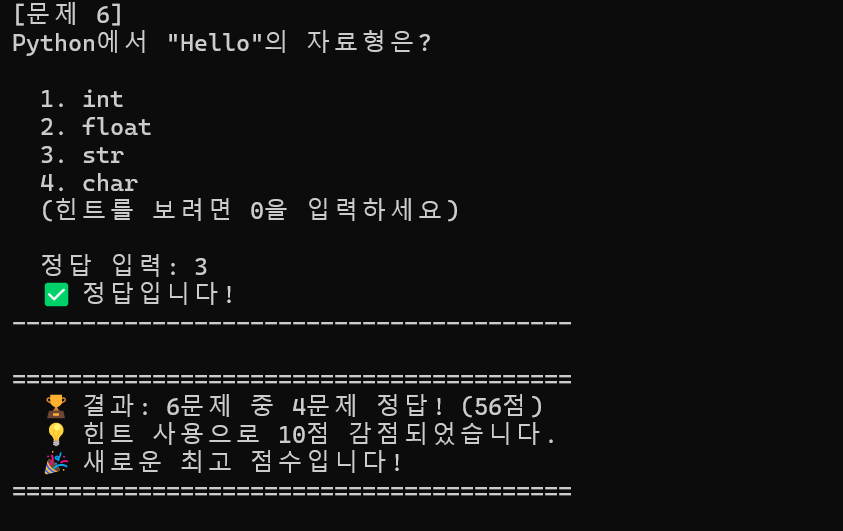

# 🎯 나만의 퀴즈 게임

Python으로 만든 콘솔 기반 퀴즈 게임입니다.  
터미널에서 퀴즈를 풀고, 새로운 퀴즈를 추가하고, 점수를 기록할 수 있습니다.  
프로그램을 종료해도 데이터가 `state.json` 파일에 저장되어 다음 실행 시 그대로 유지됩니다.

---

## 📌 퀴즈 주제 및 선정 이유

**주제: Python 프로그래밍 기초**

Python을 처음 배우면서 학습한 내용을 퀴즈로 만들면 복습 효과가 있다고 생각했습니다.  
변수, 자료형, 함수, 주석 등 기본 문법을 자연스럽게 반복 학습할 수 있도록 구성했습니다.

---

## 🚀 실행 방법

### 요구 사항
- Python 3.10 이상

### 실행
```bash
python main.py
```

외부 라이브러리 설치가 필요 없습니다. Python 표준 라이브러리만 사용합니다.

---

## 📋 기능 목록

| 번호 | 기능 | 설명 |
|------|------|------|
| 1 | 퀴즈 풀기 | 등록된 퀴즈를 랜덤 순서로 출제, 힌트 사용 가능 (감점 적용) |
| 2 | 퀴즈 추가 | 문제, 선택지 4개, 정답 번호, 힌트(선택)를 입력하여 새 퀴즈 등록 |
| 3 | 퀴즈 삭제 | 등록된 퀴즈를 번호로 선택하여 삭제 |
| 4 | 퀴즈 목록 | 등록된 모든 퀴즈의 문제 텍스트를 번호와 함께 표시 |
| 5 | 점수 확인 | 최고 점수와 전체 게임 기록(날짜, 문제 수, 점수) 표시 |
| 6 | 종료 | 데이터를 저장하고 프로그램 종료 |

### 입력 예외 처리
- 빈 입력, 문자 입력, 범위 밖 숫자 입력 시 안내 메시지 출력 후 재입력
- `Ctrl+C` 또는 EOF 발생 시 데이터 저장 후 안전 종료
- 데이터 파일이 없거나 손상된 경우 기본 퀴즈로 자동 복구

---

## 📁 파일 구조

```
ia-codyssey-Python/
├── main.py           # 프로그램 진입점 (실행 파일)
├── quiz.py           # Quiz 클래스 (개별 퀴즈 표현)
├── quiz_game.py      # QuizGame 클래스 (게임 전체 관리)
├── state.json        # 데이터 저장 파일 (자동 생성)
├── .gitignore        # Git 추적 제외 파일 목록
├── README.md         # 프로젝트 설명 문서
└── docs/
    └── screenshots/  # 실행 화면 스크린샷
```

### 클래스 구조

- **Quiz** (`quiz.py`): 퀴즈 한 문제의 데이터(문제, 선택지, 정답, 힌트)와 동작(출력, 정답 확인, JSON 변환)을 담당
- **QuizGame** (`quiz_game.py`): 게임 전체 흐름(메뉴, 퀴즈 풀기/추가/삭제, 점수 관리, 파일 저장/불러오기)을 담당

---

## 💾 데이터 파일 설명

### state.json

- **경로**: 프로젝트 루트 디렉터리 (`./state.json`)
- **인코딩**: UTF-8
- **역할**: 퀴즈 데이터, 최고 점수, 게임 기록을 영구 저장
- **생성 시점**: 프로그램에서 데이터가 변경될 때 자동 생성/갱신

#### 스키마

```json
{
    "quizzes": [
        {
            "question": "문제 텍스트",
            "choices": ["선택지1", "선택지2", "선택지3", "선택지4"],
            "answer": 1,
            "hint": "힌트 텍스트 (선택)"
        }
    ],
    "best_score": 80,
    "history": [
        {
            "date": "2026-04-07 14:30:00",
            "total": 5,
            "correct": 4,
            "score": 80
        }
    ]
}
```

| 필드 | 타입 | 설명 |
|------|------|------|
| `quizzes` | 배열 | 등록된 퀴즈 목록 |
| `quizzes[].question` | 문자열 | 퀴즈 문제 |
| `quizzes[].choices` | 배열 | 선택지 4개 |
| `quizzes[].answer` | 정수 | 정답 번호 (1~4) |
| `quizzes[].hint` | 문자열 | 힌트 (없으면 생략) |
| `best_score` | 정수/null | 최고 점수 (미플레이 시 null) |
| `history` | 배열 | 게임 기록 히스토리 |

#### 파일 손상 시 동작
- JSON 파싱 실패 시 → 손상 파일을 `state.json.bak`으로 백업 → 기본 퀴즈로 초기화

---

## 🔧 Git 실습 기록

### clone 실습
```bash
# 원격 저장소를 별도 디렉터리에 복제
git clone <저장소 URL> quiz-game-clone
cd quiz-game-clone
```

### 변경 후 push
```bash
# 복제된 저장소에서 README에 한 줄 추가 후 커밋
echo "# clone 테스트" >> README.md
git add README.md
git commit -m "Docs: clone 테스트 - README에 한 줄 추가"
git push
```

### pull로 변경사항 가져오기
```bash
# 기존 작업 디렉터리로 돌아와서 pull
cd ../ia-codyssey-Python
git pull
```

pull 후 README.md에 변경 내용이 정상 반영되었음을 확인했습니다.

---

## 📸 실행 화면 스크린샷

### 메뉴 화면


### 퀴즈 풀기


### 퀴즈 추가


### 점수 확인


# clone 실습 완료
